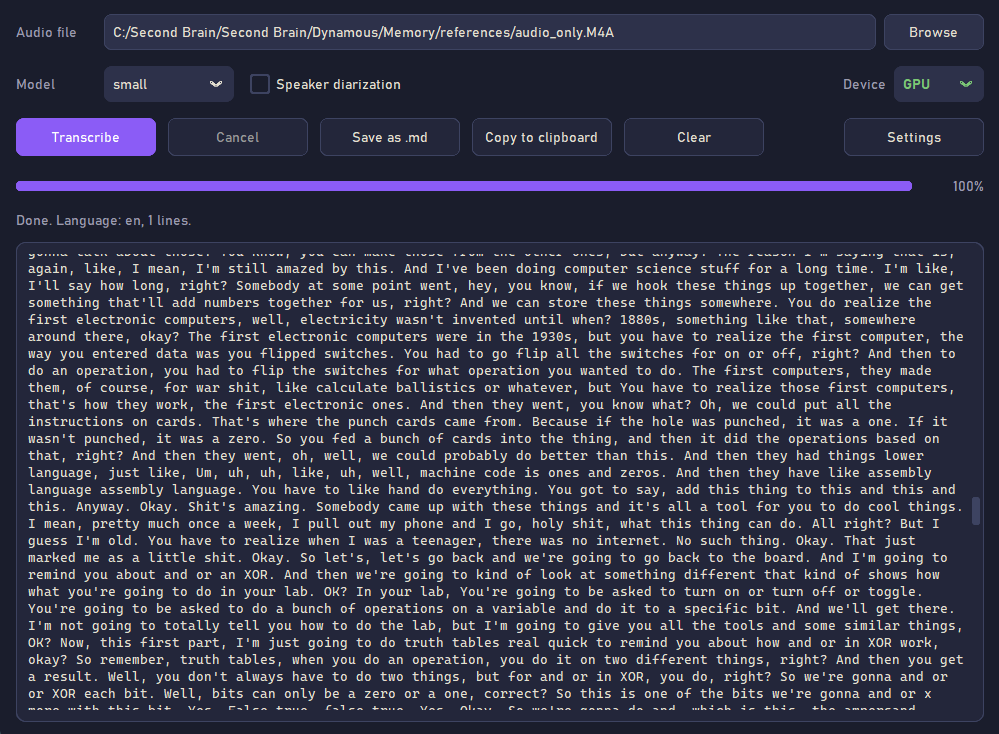
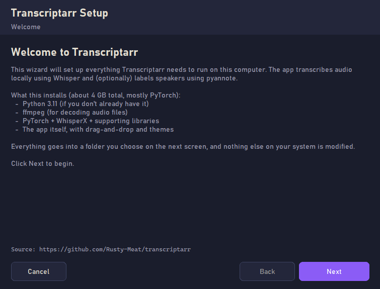
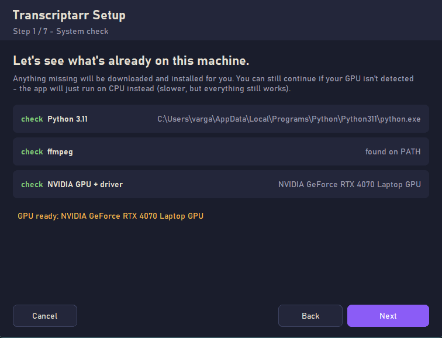
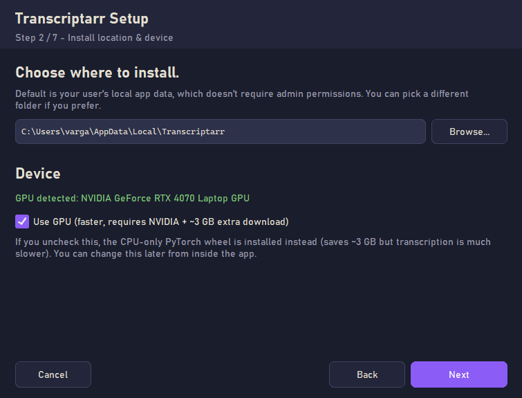
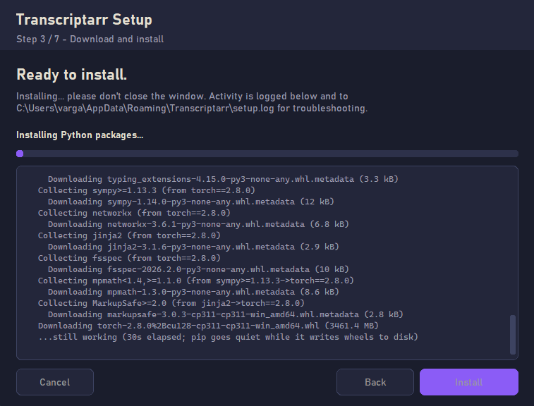
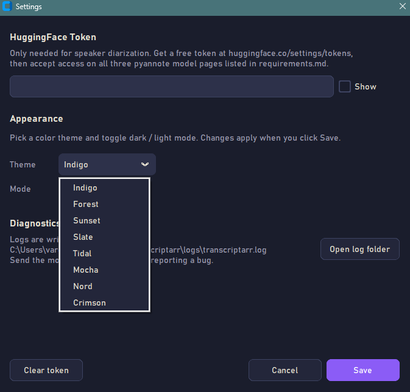

<div align="center">


# Transcriptarr

Drop any audio or video file, get a transcript with speaker labels. <br/>
Transcriptarr runs Whisper and pyannote locally on your CPU or GPU, so your audio stays on your computer. <br/>
**No cloud uploads. No per-minute fees. No file-size caps. No subscription.** <br/>
The only optional account is a free HuggingFace token, and only if you want speaker labels.


</div>

---

## 📸 Screenshots


<sub>*The main window after transcribing a clip. Indigo cosmic-purple dark theme is the default.*</sub>

### First-run setup wizard

<table>
<tr>
<td width="50%"><br/><sub><i>Welcome — what the wizard does and roughly how long it takes.</i></sub></td>
<td width="50%"><br/><sub><i>Detects Python, ffmpeg, and NVIDIA GPU. Anything missing gets installed in the next step.</i></sub></td>
</tr>
<tr>
<td width="50%"><br/><sub><i>Pick the install folder and choose CPU or GPU.</i></sub></td>
<td width="50%"><br/><sub><i>Live install progress with a verbose activity log so you can see exactly what's happening.</i></sub></td>
</tr>
</table>

### Themes


<sub>*Settings dialog with the theme picker. Eight themes, each with light and dark variants. Pick from cosmic Indigo, Forest, Sunset, Slate, Tidal, Mocha, Nord, or Crimson.*</sub>

## ✨ What you get

| | |
|---|---|
| 🎙️ | Drag and drop any audio or video (`.m4a`, `.mp3`, `.wav`, `.flac`, `.mp4`, `.mkv`, lots more) |
| 🧠 | Whisper models from `tiny` to `large-v3` &mdash; pick speed vs. accuracy |
| 👥 | Optional speaker labels (`[SPEAKER 1]: ...`) via pyannote |
| ⚡ | NVIDIA GPU support for fast transcription, CPU fallback when there's no GPU |
| 🎨 | 8 themes, each with light + dark variants. Indigo cosmic-purple is the default |
| 💾 | Export as `.md`, copy to clipboard, drag-resize the window, the usual things |
| 🔌 | Fully offline after first run. Models cache locally and never re-download |
| 📜 | Logs to `%LOCALAPPDATA%\Transcriptarr\logs\` so when something breaks, you can see why |

## 🚀 Quick install (Windows)

1. Grab the latest **`Transcriptarr.exe`** from the [Releases page](https://github.com/Rusty-Meat/transcriptarr/releases)
2. Double-click it
3. Windows SmartScreen will probably show **"Windows protected your PC"**. Normal for unsigned hobby apps. Click **More info → Run anyway**
4. The setup wizard takes it from there:

```
Welcome  ->  Detect what's missing  ->  Install location & device choice
                       |
                       v
        Download & install (~1 GB on CPU, ~4 GB on GPU)
                       |
                       v
   HuggingFace token (optional)  ->  Pyannote ToS  ->  Shortcuts  ->  Done
```

After install, just run `Transcriptarr.exe` (or the desktop shortcut). It skips the wizard and goes straight to the app.

## 🖥️ System requirements

- **Windows 10 or 11** (64-bit)
- **~5 GB free disk space** (PyTorch is the heavy one)
- **NVIDIA GPU optional** — without one the app runs on CPU. Works fine, just 5–15× slower depending on model size
- **Internet for the initial download.** After that, fully offline

You don't need Python, ffmpeg, PyTorch, or anything else pre-installed. The wizard fetches everything.

## 👥 Speaker labels (optional setup)

Want `[SPEAKER 1]:` / `[SPEAKER 2]:` in your transcripts? You'll need a free HuggingFace token AND you have to click "Agree" on three pyannote model pages. The wizard walks you through it. Skip it if you don't need labels — transcription still works without them.

<details>
<summary>The three pyannote pages you need to accept</summary>

- [pyannote/segmentation-3.0](https://huggingface.co/pyannote/segmentation-3.0)
- [pyannote/speaker-diarization-3.1](https://huggingface.co/pyannote/speaker-diarization-3.1)
- [pyannote/speaker-diarization-community-1](https://huggingface.co/pyannote/speaker-diarization-community-1)

You only have to accept once per HuggingFace account. After that the models download on first use of speaker diarization and are cached in `~/.cache/huggingface/`.

If you skipped the wizard's token step, you can paste it later from the app's **Settings** dialog.
</details>

## 🔄 Updates

`update.exe` is bundled inside `Transcriptarr.exe` and gets copied into your install folder during setup. Run it whenever you want to:

- 🔍 **Check for a new version** — auto-runs at launch, hits the GitHub API, tells you what's available
- ⬆️ **Install the update** — downloads the new code, backs up your current version, swaps it in. Five clearly-labeled steps with a verbose log so you can see exactly what's happening
- 🩹 **Repair a broken install** — verifies ffmpeg, the venv, and key Python packages. Fixes anything missing

No need to come back to GitHub manually. The app phones home (just to check version, that's it) only when you open `update.exe`.

## 🎨 Themes

8 themes, each with a `dark` and `light` palette. Switch via **Settings → Theme** (changes apply on Save).

| Theme | Vibe |
|---|---|
| **Indigo** *(default)* | Cosmic purple accent. Dark = ink on midnight indigo. Light = soft cream paper |
| **Forest** | Cool greens, gentle and natural |
| **Sunset** | Warm peach/orange, golden hour energy |
| **Slate** | Clean neutral, like Linear or Notion. The "professional" pick |
| **Tidal** | Deep ocean teal-cyan |
| **Mocha** | Coffee shop browns. Cozy alternative to Sunset |
| **Nord** | The famous Polar Night palette, beloved by devs |
| **Crimson** | Wine red on parchment, library / study mood |

## 🛠️ Run from source (developers)

If you'd rather skip the .exe and run the app yourself:

```bash
git clone https://github.com/Rusty-Meat/transcriptarr.git
cd transcriptarr

py -3.11 -m venv .venv
.venv\Scripts\activate
python -m pip install --upgrade pip
pip install whisperx
pip uninstall -y torch torchaudio torchvision
pip install torch==2.8.0 torchaudio==2.8.0 --index-url https://download.pytorch.org/whl/cu128
pip install customtkinter tkinterdnd2 hf_xet

python transcriptarr.py
```

For CPU only, swap the torch line for the CPU index:

```bash
pip install torch==2.8.0 torchaudio==2.8.0 --index-url https://download.pytorch.org/whl/cpu
```

You'll also need [ffmpeg](https://www.gyan.dev/ffmpeg/builds/) somewhere on your `PATH`.

### Building the .exe yourself

```bash
pip install pyinstaller
build.bat
```

Outputs `dist\update.exe` and `dist\Transcriptarr.exe`. The wizard will pick up your icon (`transcriptarr.ico`) automatically.

## 🐛 Troubleshooting

<details>
<summary>Why does Windows warn me when I run the .exe?</summary>

Windows SmartScreen flags unsigned executables. `Transcriptarr.exe` is unsigned because code signing certificates cost money this project doesn't have yet. Click **More info → Run anyway** the first time. After that Windows trusts it.

If you're concerned, the entire source code is in this repo and the build pipeline runs publicly via [GitHub Actions](https://github.com/Rusty-Meat/transcriptarr/actions). You can also build from source and skip the .exe entirely.
</details>

<details>
<summary>"ffmpeg not found" / "could not decode the audio file"</summary>

Setup downloads ffmpeg into `<install folder>\ffmpeg\bin\`. The app prepends that to PATH at launch. If it's missing, run `update.exe` and click **Repair installation**.
</details>

<details>
<summary>Diarization fails with 401 / 403 / Repository not found</summary>

Either your HuggingFace token is wrong, or you didn't accept the user conditions on all three pyannote pages. Open the app's **Settings**, paste your token, and visit all three URLs to click "Agree". See [Speaker labels](#-speaker-labels-optional-setup) above for the URLs.
</details>

<details>
<summary>Out of GPU memory</summary>

Use a smaller Whisper model (`small` or `medium`) or switch to CPU via the **Device** dropdown. Large models need ~10 GB of VRAM.
</details>

<details>
<summary>The wizard runs every time I open Transcriptarr.exe</summary>

The tracker file at `%APPDATA%\Transcriptarr\install.json` got deleted or corrupted. Re-running the wizard rebuilds it; pip skips already-installed packages so it's fast.
</details>

<details>
<summary>Where do I find the logs?</summary>

- **Setup logs:** `%APPDATA%\Transcriptarr\setup.log`
- **App logs:** `<install folder>\logs\transcriptarr.log` (or whichever folder you chose during install)
- **Updater logs:** `%APPDATA%\Transcriptarr\update.log`

When reporting a bug, attach the most recent log.
</details>

<details>
<summary>How do I uninstall?</summary>

There's no automatic uninstaller yet. Manually:

1. Delete the install folder (default: `%LOCALAPPDATA%\Transcriptarr\`)
2. Delete `%APPDATA%\Transcriptarr\` (tracker, logs)
3. Delete the desktop / Start Menu shortcuts you created
4. Optionally delete model caches at `%USERPROFILE%\.cache\huggingface\`

Or run `Transcriptarr.exe --uninstall` from a command prompt to just remove the tracker (so a re-run shows the wizard again).
</details>

## 🙏 Credits

Built on the shoulders of:

- [WhisperX](https://github.com/m-bain/whisperX) by Max Bain et al. — alignment + diarization scaffolding
- [pyannote.audio](https://github.com/pyannote/pyannote-audio) by Hervé Bredin et al. — speaker diarization
- [CustomTkinter](https://github.com/TomSchimansky/CustomTkinter) by Tom Schimansky — modern Tk widgets
- [tkinterdnd2](https://github.com/pmgagne/tkinterdnd2) — drag-and-drop bindings for Tk
- [ffmpeg-builds](https://www.gyan.dev/ffmpeg/builds/) by gyan.dev — Windows ffmpeg static builds

## 📜 License

MIT
